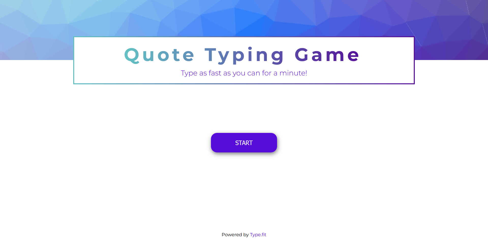
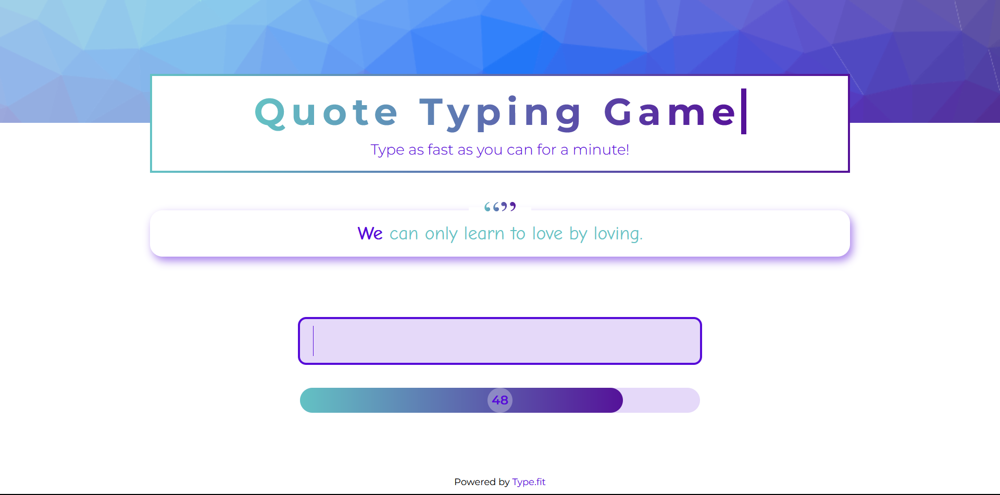
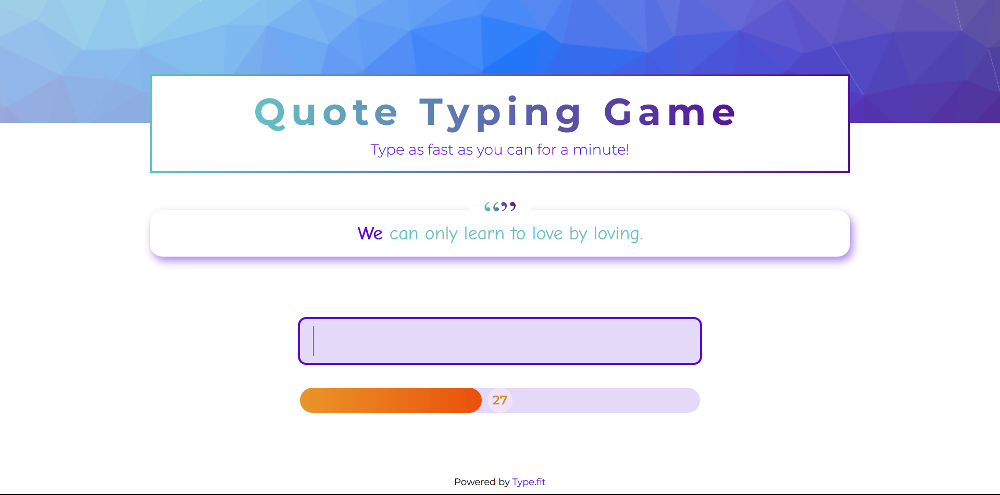
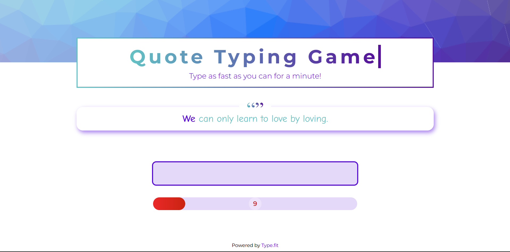
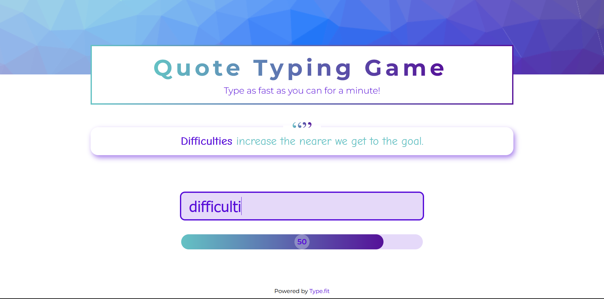
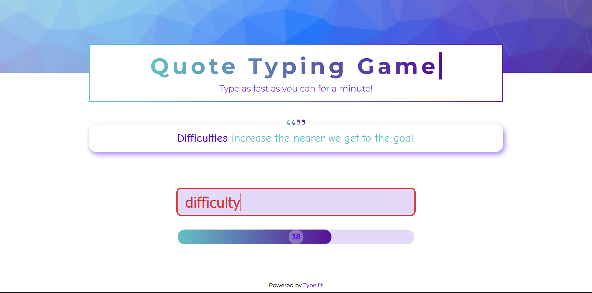
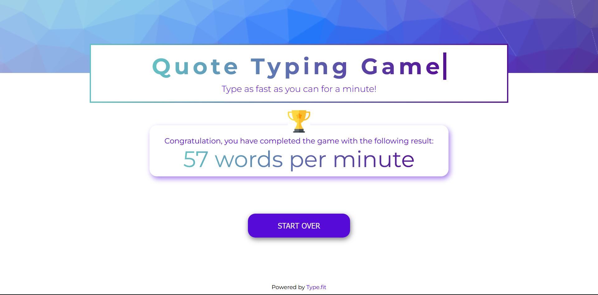

# Quote Typing Game

A simple typing game built using React, Vite, and Typescript.

## Rules

The player should type as many words as they can within a 60-second timeframe.

## Demo

<https://mad4869.netlify.com/library/typing-game>

## API

This app utilizes the __Quote API__ provided by [type.fit](https://type.fit/)

## Requirements

The typing game should have the following features:

1. The target text that the player should type in the input field to gain scores.
2. An indicator of the current target word.
3. An error alert when the player makes a typo.
4. A 60-second countdown to keep track of the remaining time for the player's playtime.
5. A final score review once the game is complete.

## Test Case

### 1. Target text, target word indicator, and the countdown

### 2. Error alert

### 3. Final score review

## Conclusion/Future Work

__Quote Typing Game__ is a simple typing game constructed using React, Vite, and Typescript. In this game, the player's objective is to type as many words as possible within a 60-second timeframe. It boasts features such as a target word indicator and an error alert to aid the player in achieving their goal. However, there is ample room for enhancing the player experience through the incorporation of additional features, including:

- An option to switch the text category to something other than a quote.
- An option to adjust the duration of the gameplay timeframe.

These features can make the typing game even more engaging and enjoyable.
